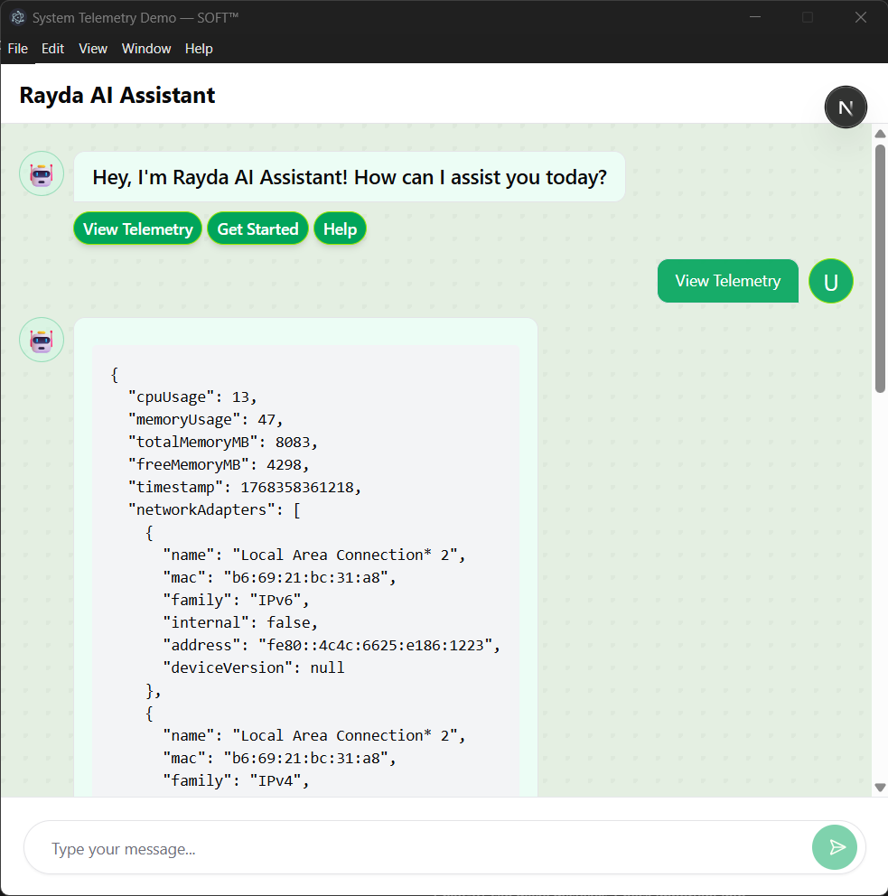
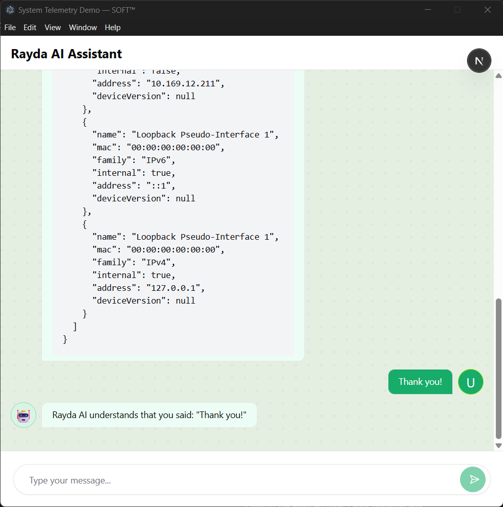

# System Telemetry Desktop Demo (Electron)

This project is a cross-platform desktop application built with **Electron + Next.js** to demonstrate system telemetry collection, secure IPC communication, and a simple chat-style UI.

It is intentionally scoped to showcase **architecture, security awareness, and defensive engineering**, rather than completeness of data or UI complexity.

---

## 🖥️ Development Environment

This assessment was developed and tested on:

- **OS:** Windows 11
- **Node.js:** v22.17.0
- **Electron:** v39.2.5

The application is designed to be cross-platform and should run on Windows, macOS, and Linux, with graceful handling of OS-specific telemetry differences.

---

## 🧱 High-Level Architecture Overview

Electron applications consist of two primary layers:

- **Main Process**

  - Controls application lifecycle
  - Collects system telemetry using Node.js APIs
  - Exposes a minimal, secure IPC surface

- **Renderer Process**
  - Runs the UI (Next.js + React)
  - Has **no direct access** to Node.js or OS APIs
  - Communicates with the main process via IPC

A **preload script** is used to safely bridge communication using `contextBridge`.

---

## 🔐 Security Model

The application follows Electron security best practices:

- `nodeIntegration: false`
- `contextIsolation: true`
- All OS-level operations remain in the main process
- Renderer communicates via **explicit IPC channels only**
- No direct filesystem or system access from the UI

This prevents privilege escalation and reduces attack surface.

---

## 📡 Telemetry Collection

Telemetry is collected in the **main process** using Node.js APIs on a best-effort basis.

Currently collected data includes:

- Platform (Windows / macOS / Linux)
- CPU information
- Memory usage
- Network interface metadata (where available)

### Best-effort approach

This approach avoids OS-specific hacks that may be unstable or non-portable across platforms.
Not all operating systems expose the same telemetry fields.  
Missing or unavailable values are handled gracefully and returned as `null` rather than causing failures.

OS-specific limitations are documented rather than worked around using unsupported hacks.

---

## ⚠️ Platform Limitations

- Network adapter metadata (e.g. driver version or update timestamps) is not consistently exposed across operating systems.
- Some fields may be unavailable depending on OS and hardware.
- Missing values are returned as `null` to avoid failures.

No OS-specific or undocumented system calls were used to bypass these limitations.

---

## 🔁 Data Flow (Pull-Based)

Telemetry is:

- Collected periodically in the main process
- Cached as the latest snapshot
- Exposed to the renderer via IPC on request

The renderer **pulls** telemetry at intervals instead of receiving continuous push events, minimizing overhead and avoiding unnecessary background activity.

---

## 💬 Chat UI

A simple chat-style interface is included to simulate interaction with a system assistant.

Features:

- Message bubbles (user vs system)
- Scrollable message history
- Clean, minimal UI using Tailwind CSS and shadcn/ui

The chat currently operates locally and is intentionally decoupled from telemetry execution logic.

---

## 🛠 Tech Stack

- **Electron**
- **Next.js (App Router)**
- **TypeScript**
- **Tailwind CSS**
- **shadcn/ui**

---

## 🔁 IPC Communication Flow

Renderer and OS-level logic are strictly separated.

```text
Renderer (Next.js UI)
│
│ IPC invoke (read-only)
▼
Preload Script (contextBridge)
│
│ Whitelisted APIs
▼
Main Process (Electron)
│
│ Node.js / OS APIs
▼
System Telemetry
```

_Only explicitly exposed APIs are accessible to the renderer._

---

## 🔐 Permission-Based Task Execution (Design)

For any action that mutates system state (e.g. running diagnostics, restarting services):

1. The renderer requests an action via IPC
2. The main process validates the request
3. A user-facing confirmation dialog is shown
4. Only after explicit consent is the task executed

This prevents silent or unauthorized system operations and aligns with OS security expectations.

---

## 📸 Sample Telemetry Injection (Runtime)

Below is an example of telemetry injected into the chat UI during runtime.




---

## 🚀 Running the Project

### Development

```bash
npm install
npm run dev
```

This starts:

- Next.js dev server
- Electron app pointing to the local frontend

### Build (Production)

```bash
npm run build
npm run dist
```

Generates a packaged Electron application.

## 📝 Notes

- Background workers and permission-gated task execution are intentionally left as future refinements.
- The goal of this demo is clarity, security, and system awareness — not feature completeness.
